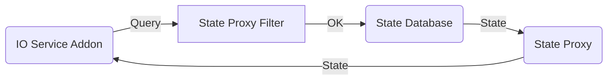

# Develop IO Services

An IO Service Addon exposes Things, making them accessible for other services or home automation systems. An example might be a http REST-like interface to control Things, start and create scenes and setup alarms.
This chapter outlines all operations to archive this.

## Querying Things and Rules

Thing States as well as Rules are sensitive information. A user may choose to not share everything with an Addon. For example if just lightbulbs should be exposed to Amazon Alexa and not the electronic door lock. Another example is a guest account for switching lightbulbs but not other appliances.

For accessing Things, Thing States, Rules and Rule States the THINGS, THINGS_STATES, RULES permission could be acquired. This is *not* the idomatic way and will result in a big, intimidating privacy warning notification during addon installation.

Instead, you communicate through State Proxy Filters and query those for Thing and Rule State changes.

A State Proxy Filter connects to the *State Database* and is configured by the user with "forwarding" rules, not much different than a software firewall.



```rust
use ohx::{StateFilter, users, AddonContext};

fn filter_installed(ctx: &AddonContext, filter: &StateFilter) {
    // Get all things with thing properties
    let things = filter.get_things();
    // Get a stream of things with thing properties
    // Each time a Thing gets added or reconfigured or deleted this stream gets updated.
    // Thing, Thing property updates to not cause a stream update
    let stream_of_things = filter.query_things();

    // Thing and thing property state updates are queried separately and do not contain Thing descriptions
    let stream_of_thing_states = filter.query_thing_states();
}

fn filter_removed(ctx: &AddonContext, filter: &StateFilter) {
    
}

fn main() {
    // ...
    // Set all mandatory and optional arguments.
    builder = builder.withFilterCallbacks(&filter_installed, &filter_removed);
    // ...
}
```

As seen in the code example, you do not create *State Proxy Filters* yourself. Those are created by OHX. The next section explains when that happens.

## IO Service Access Entities

An State Proxy Filter is always linked to a "user", may it be an OHX user account or an IO Service managed "user" or access token.

Own Access Roles Implementation Example
: An example is the Hue Emulation IO Service. A Hue App needs to pair with the bridge, or in this case OHX. On the <a class="demolink" href="">Maintenance</a> page in **Setup &amp; Maintenance** you find the *Hue Emulation IO Service* in the left side menu. On that configuration screen you can enable pairing. Each device that connects in that time period is assigned to the selected or just created "API Token". This way you can restrict each paired device to an own set of Things and Rules.

OHX App + Dashboard Example
: You need to login as one of the OHX users before you can use the OHX App or Dashboard. The corresponding WebThings IO Service can therefore associate each command and Thing State query with an account. You use the normal user account restriction mechanisms if you want to limit a users capabilities.

### OHX Accounts 

If you use the OHX account system, there is not much you need to do. State Proxy Filters will be created automatically for all existing and new users and will also be removed automatically when the user account disappears.

### Own Access Management

If you are going for your own access manager, you need a way for the user to create a new "account" or "access token" and remove / revoke those again.

You also need to register your access manager via the registration call.

```rust
use ohx::{ioservice, users};

struct User {
    api_token: String;
    name: String;
}

struct AccessManager {
    users: Vec<User>;
}

impl ioservice::AccessManager for AccessManager {
    // ...
}

fn main() {
    let accessManager = AccessManager:new();
    // ...
    // Set all mandatory and optional arguments.
    builder = builder.withAccessManagement(accessManager);
}
```

Whenever you create a user, edit a user or remove a user, you must inform the framework.
The framework will create / remove *State Proxy Filters* in turn and call you back if you have filter callbacks registered as in the code example of the previous section.
