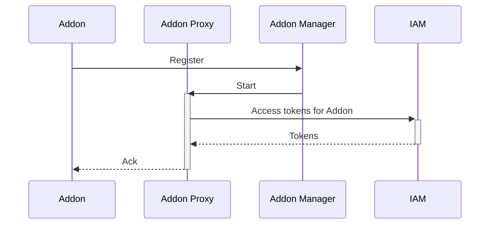
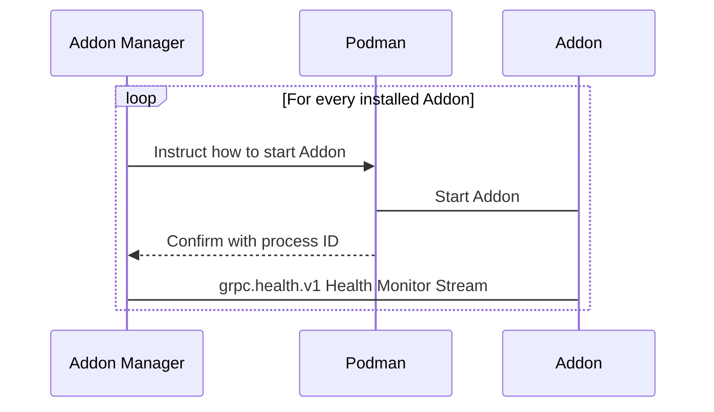
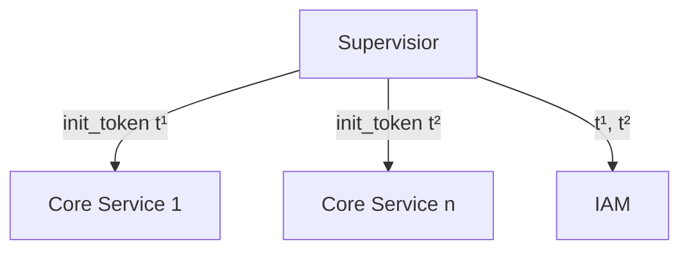
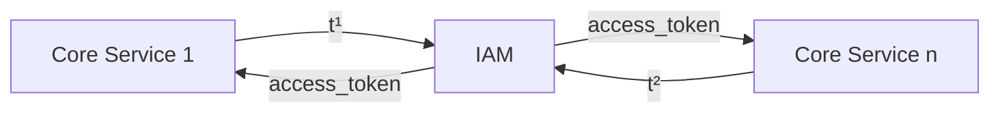
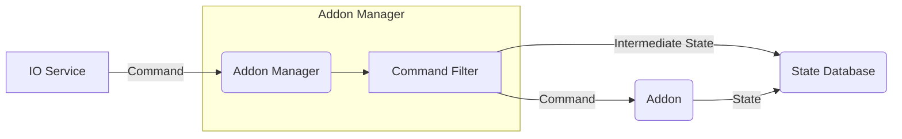

# OHX Architecture

This chapter talks about the general architecture of OHX and how services interact with each other.
This overview provides an insight on what technologies and protocols are used in which situations and also talks about alternatives when appropriate.

OHX follows a microservices architecture, meaning that it is composed of multiple single-purpose processes.
It makes use of external, well-known and understood solutions and protocols whenever possible,
as long as those match with the [design principles](/developer/design_principles):

* The historic state and time-series database an InfluxDB 2 instance.
* The container engine is docker or podman and uses the [Windows Subsystem for Linux](https://docs.microsoft.com/en-us/windows/wsl/install-win10) on Microsoft Windows&trade;.

All other services are called OHX Core Services and are developed by OHX developers and contributors.
The programming language for Core Services is Rust.

## Protocols
Services interact with each other via remote procedure calls.
gRPC (**protobuf** on top of http2) has been chosen as the interprocess protocol and mechanism.
Protobuf specification files are used to automatically generate API documentation for each service.

The maintenance web interface interacts with core services via a REST like https API with server-send-events for streamed data.

## Overview
To get a general idea of all involved components, let's have a look at the following picture.
The picture is divided into a left and right area.
Left representing the general network / Internet and to the right all services without Internet exposure are shown.
Services that sit on the border are exposing network ports.



The next sections introduce some of the components found in the picture above.
At the end of this chapter you should have a general understanding of the OHX architecture.
You find in-depth discussions and API usage examples in dedicated chapters.
 
## Addons

An Addon in OHX may consist of multiple processes (services).
At least one process registers itself to the **Addons Manger**.
An Addon usually integrate external web-services or devices ("binding") or exposes OHX Things in some form or another ("IO Service").

For easy distribution and enhanced resource control as well as enforcing security features, Addon processes are bundled and running as *software containers*.

> A **container** is a standard unit of software that packages up code and all its dependencies so the application runs quickly and reliably from one computing environment to another.
Containers are not virtual machines! A container process can be easily restricted in its resource usage, including main memory, cpu time, disk and network access as well as direct hardware control.
A known container implementation is Docker.

In most cases your Addon consists of exactly one container, which runs software that is linked to `libAddon`.
Sometimes you might require additional external services, like a database.
This is when you have more than one container running.

### OLD; State proxy

Containers do not have direct access to the state database (Redis) or historic state database (InfluxDB)
and communicate via a per-Addon proxy process (**StateProxy**).
The user can configure filter rules on each proxy to limit Thing and Thing State exposure.

To understand how an Addon communicates with OHX, have a look at the following sequence diagram.

1.
Your Addon registers to *AddonsManager*.

2.
The *AddonsManager* will start a dedicated process, the *StateProxy*.
The *StateProxy* will request service tokens for the *State Database (Redis)* and the *Historic State Database (InfluxDB)* from the `IAM` service.

Each Addon runs as its own user on the standalone installation to further restrict access.

The [Addon](/developer/addons) chapter contains all information about Addon development and some more details about the startup and publish process.

## Addon Manager

The addon manager process (`ohx-core`) maintains a list of registered and running addons.
It also talks to [podman](https://podman.io/), the daemonless container engine that is used together with OHX, for starting installed addons.

We refine this model in the dedicated sections about binding and IO Service development in the [Addons](/developer/addons) chapter.

## Temp / Cache Storage

The temp storage is used by the *Addon Manager* for temporarily storing downloaded Addon images,
and by the *Static File Server* to temporarily store downloaded user-interface bundles.
Addons can access the temp storage for up to 50 MB data on `/tmp`.
And the cache storage via the different available storage permissions (see [Addons](/developer/addons) chapter) on `/cache`.

**OHX-OS**: The generic file storage is [quota](https://access.redhat.com/documentation/en-us/red_hat_enterprise_linux/6/html/storage_administration_guide/ch-disk-quotas) restricted per user on the standalone installation.
This is archived via `/etc/fstab` entries with `usrquota` option set.
You can use the `quotacheck` tool to examine the generic storage mount point.

## Configuration Storage

*Configuration* in OHX is Service configuration, Inbox accepted Things, Manually configured Things, Rules, Rule Templates.
*Runtime-Only Documents* are config descriptions (JSonSchemas), Thing descriptions ([WoT TD](https://w3c.github.io/wot-thing-description/)), Inbox Thing instances, Refresh Tokens.

Configuration happens in *Namespaces*.
Each addon and each service, for example the user-credentials one, get their own namespace and have **no** access to configuration in any other namespace.
An exception is, if the CONFIG_ALL permission has been acquired by a service.

This is implemented via software [container volumes](https://docs.docker.com/storage/volumes/), pointing each to a subdirectory of `${OHX_HOME}/config`.
Configuration of the namespace "addon-zwave" for instance can be found in `${OHX_HOME}/config/addon-zwave`.

Standalone
: In a standalone installation, the operating systems filesystem is immutable, including the `/etc` directory.
An overlayfs is mounted, using files residing in the OHX configuration storage under the namespace "os-etc".
Most importantely this includes Wifi and Network Configuration (networkmanager) and Supervisior configuration (systemd).

Checkpoints & Restore
: OHX supports configuration checkpoints and restoring.
Git is used to archive a specific point in time.
Git remotes can be added in the **Backup &amp; Restore** service.
Automatic commits are performed every 24 hours and if remotes are added and credentials are present, automatic pushes happes as well.
Creating a configuration checkpoint means git tagging.
Restoring means checking out a previous tag.

This architecture allows to synchronize OHX instances.
If the periodic git commit and push cycle is not instant enough, GlusterFS or a similar scalable network filesystem works.

## Identity and Access Management (IAM)

There are great, advanced, maintained and open source solutions for identity and access management like [Keycloak](https://www.keycloak.org/).
Unfortunately those solutions are not really scaling down to a few megabyes of memory usage with an estimated user count of 1 or 2 per installation and a few dozen access tokens.
Keycloak for example is a Java application, meaning that a full jvm need to be loaded as well.

Requirements for this service are:

* Interprocess / service authentication, including scopes / permissions
* Revokable access tokens
* User database, holding user credentials but also permissions, thing & rules filter and potentially other meta data
* Compatible to an enterprise interface for user management


SAML 2 was also evaluated, but it is too complex and heavy with its big xml SOAP messaging and embedded x509 signatures for openHABs SSO and service authentication.



OHX IAM implements [OpenID Connect Discovery](https://openid.net/connect/) for the identity broker part via [Konnect](https://github.com/Kopano-dev/konnect) with [GlAuth](https://github.com/glauth/glauth) as ldap backend for the credentials database.
OpenID Connect Discovery is based on OAuth2.

Access Tokens and Refresh Tokens in OHX are [Json Web Tokens (JWT)](https://jwt.io/).
Such a token can carry additional information, which is used to communicate connection endpoints like the Redis DB URL or an InfluxDB username+password).
Refresh Tokens have a limited life-time of 1 hour.
Access Tokens can be revoked.

Access to certain services or information is restricted by *Permissions* in OHX.
A permission maps to an *OAuth 2 Scope*.
Access tokens have all granted *Scopes* encoded and can be verified by a destination service without calling back to IAM.


IAM is probably the most powerful service.
It is responsible for provisioning tokens to all other services and the entire interprocess communication comes to a halt if no tokens or invalid tokens are issued.
An attacker that gained access to IAM has basically full control.


### Securing Core Services

The root filesystem and operating system binaries are assumed to be immutable, especially the supervisior.

It is necessary to create an initial trust between core services.
This can be archived by a public-private key based token signing where public keys are injected into each service.
This is quite a burden for development though.

Instead the supervisior process (systemd on the standalone installation) generates a random one-time access token for each core service and passes it via stdin.

The supervisior will start IAM and pass all generated access tokens to it.
As mentioned each token is valid for exactly one connection attempt.

If a core service looses connection to IAM or the connection is denied it will quit and the supervisior starts it again with a newly generated token, notifying IAM.

This procedure effectively prevents 3rd party processes to connect to IAM.

This procedure does not help if a core service has been taken over by malicous code.
That's why a core service only has as much privilege as it needs and runs in a separate software container with limited assigned memory, restricted filesystem access, constant CPU usage and system call monitoring.

## Rule Engine

The Rule Engine service is responsible for executing rules.
The service caches rules (up to 10 MB) and keeps its cache coherent via filesystem change notifications.
It runs a configurable thread pool with a default set of 5 threads, meaning 5 rules can run in parallel.
Important to note is that delayed rules are suspended and do not count towards the limit.
A *Rule* is generally not assumed to run for long, but certain scenarios like a light animation sequence or a file upload might block a rule thread for good reason.

Because *Scenes* are Rules, the Rule Engine service also implements the Addon Binding interface and exposes button Things per configured *Scene*.

More information about the rule engine implementation can be found in the [Core Services](/developer/coreservices#rule-engine) chapter.

## Command Queue

A *Command* in OHX consists of a target (Addon-ID + Thing-ID + Property-ID) and a new state.
The state is usually a plain text value like "100%" or "on" or "true" but can also be a complex type depending on the target Addon.
A command can target

* an Addon ("Enable Pairing mode for Hue Emulation Addon"),
* a Thing ("Start self-healing of Zigbee Network"),
* a Thing Property ("turn light brightness to 50%").

*Commands* originate from &hellip;

* *IO Service Addons* that receive commands themselves (like from a Web user interface or an App),
* the Rule Engine,
* an API call.

*Commands* are forwarded to the *Addon Manager* which in turn forwards allowed and filtered commands to respective Addons and to the state database.

In the original design a dedicated message bus process was intended.
For that purpose ZeroMQ, nanomsg, NNG and RabbitMQ were evaluated.
Solutions like Kafka, ActiveMQ are no options because of Java.
NNG was to be found as the most lightweight and modern option.
It is the successor of nanomsg and written by the same author than ZeroMQ.

Because the only real consumer of such a message queue is the Addon Manager, and per-process queuing of commands is also already performed in `libAddon`, the message bus process was removed from the overall concept of OHX.

## State: Redis / InfluxDB Databases



State in OHX is stored in two different types of databases.
Time-Series data is stored in InfluxDB.
State data like Thing States (identified by Thing-IDs), Thing Property States (identified by Thing-Property-IDs), IAM Refresh Tokens etc are stored in-process.
A restart of OHX therefore causes all Things to not have a current state.
A restart triggers `libAddon` and other consumers to re-publish states though.

Graphs for time-series runtime metrics or Thing States and Thing Property States are provided by InfluxDB 2.
The integrated database web interface and its configurable dashboards for grouping visualisations is used.

InfluxDB has a user management system.
This is synchronized with the user account system of OHX by IAM.
For all existing and new OHX user accounts a matching InfluxDB user is created.

IAM additionally maintains temporary users on InfluxDB with restricted table and no dashboard access.
Those are passed to services for runtime metric reporting.

Certain dashboards are auto-generated by the *Addon Manager* on start for each user.
For example the runtime metrics dashboard for memory, CPU usage, Rule invocations etc.
The *Setup & Maintenance* interface allows to "observe" a *Thing* or *Thing Property*.
Observing means that the Thing ID / Thing Property ID is added to the shared **StateProxy** configuration and a dashboard is created for the currently logged in user.

## Runtime metrics

InfluxDB which is used for Thing State History is also used for runtime metrics.
It understands the [Prometheus](https://prometheus.io/) format, which makes it compatible to a lot of application monitoring and alerting needs.
Find more information in the [Data History / Runtime Metrics](/developer/metrics) chapter.

## Logging

OHX services log to the standard output channels.
On the standalone installation those outputs are routed to journald, which understands the used logging format and tokens.
journald is then used for any log queries, log sorting and filtering.

Addons standard output channels are captured by the addon manager and also routed to journald.
If the used logging format is not recognised and log messages cannot be tokenized by journald, log queries are limited to fulltext search.

## Offline voice recognition

Integrating an offline voice recognition service is a bit tedious.
That's why OHX focuses on [Almond](https://almond.stanford.edu/) for now although there are other open source and commercial alternatives on the market.

To offer fast recognition speed, the Almond container has the CPU_MAX and MEM_1000 permissions set.
You should use microphone arrays that already do pre-processing like noise cancelling to offload work from the CPU.

The home automation "Intents" are installed by default in various languages.
The implementation is done via an "IO Service Addon" so that a user can filter and restrict which Things and Rules are exposed to Snips.Ai.

The ecosystem of Snips.Ai also consists of a marketplace for additional "Intents" and "Apps".
You may install those, but it is not guaranteed that they survive an OHX update or operating system update.

## Cloud Connector

The *Cloud Connector* is an "IO Service Addon" that exposes your allowed Things, Thing properties to a Google Firestore database and listens to Firestore Real-Time changes, extracting commands that are send to the *Command Queue* service.

This allows cloud functions on Amazon and Google infrastructure to interact with Amazon Alexa and Google Home in basically real-time.

The *Cloud Connector* also contains *Cloud Backup* which periodically zips your configuration directory, encrypt it and pushes it to the Google Firestore drive.