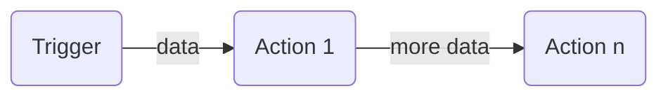

# Core Services

Learn about some details of the core services in this chapter.
Core services are developed in Rust ("Rust is a multi-paradigm system programming language focused on safety, especially safe concurrency.").

## Rule Engine

The rule engine spawns 5 threads in a pool by default.
All rules are executed in the same process which requires rule modules to be stable code.
Execution happens with the new Rust Async support, meaning that the runtime event loop queues many more rules for simultaneous execution.

Rule module execution could also be modelled as process spawning with interprocess communication.
The engine and available rule modules are not extendable via addons and only reviewed code contributions are considered.
For efficiency reasons the thread pool has been chosen.

A **security** concern as well as **stability** concern is the javascript engine, which happens to be the mozilla spidermonkey one.
It runs in-process and any crash in the complex spidermonkey codebase crashes the rule engine.

Any malicous, non-legit script that breaks out of the engines sandbox can affect the OHX installation with the permission level of the rule engine.
A script also has unlimited access to the network, meaning that it can download and execute further scripts.
This needs to be observed and if necessary, revised in the future.

### Start up

The engine registers to configuration storage changes for the "rules" namespace.
All rules are loaded and parsed and respective rule modules are instantiated.

A rule runs with the rule engines process id and privileges, but not with the rule engines access tokens.
A rule is always bound to the user that created it and fails to run if that user got removed.
A rule get access tokens from the IAM service on start up to execute and act on behalf that user.

### Rule Execution

Whenever a registered trigger starts a rule, the conditions are checked concurrently.
If all conditions match, the actions are executed in series.

The trigger, as well as actions, may produce output.
The output is handed from one module to the next, and merged with newly generated output.



## Wifi Connect

The [BalenaOS Wifi Connect](https://github.com/balena-io/wifi-connect) project has been adopted and modified for the initial start on the standalone installation.
The service offers a gRPC interface to the network manager.

## IO Service: WebThings

The WebThings IO Service exposes all Things via the [Web Things API](https://iot.mozilla.org/wot/) standard draft (14 July 2019).
Some keys that are published are not part of the standard, like the "configuration" key or the "mimetype" key or the data type "binary".
User-interfaces that are aware of those, will render better results, all others will just ignore corresponding Thing properties.

The service also adds a way to list all available Things on the http root, which is not yet part of the Web Things API.
Currently this is just a json list of strings with relative urls to Things, that looks like this:
```json
[
  "/things/thingid1",
  "/things/thingid2"
]
```

The service also allows a websocket connection on the http root, which is also not yet part of the Web Things API.
The original [websocket API](https://iot.mozilla.org/wot/#web-thing-websocket-api)s messages do not contain the Thing ID, because the websocket connections are established a per Thing base.
This is different for the root websocket connection.

Instead of: 
```json
{
  "messageType": "setProperty",
  "data": {
    "leftMotor": 100
  }
}
```

you need to wrap messages with the Thing ID:
```json
{
  "thingid": {
    "messageType": "setProperty",
    "data": {
      "leftMotor": 100
    }
  }
}
```

The service also adds an emulated Thing "OHX".
This Thing has multiple "events" defined, which are used to push notifications to WoT clients.
A client should subscribe to the "emergency" event.
Notifications about crashed containers, low disk space, ddos attacks are pushed via this event.

Groups, Scenes, Scheduled Tasks are also exposed as Things, tagged as "Group", "Scene", "Scheduled" respectively.

Generic rule creation, editing, removal is not part of the WoT interface.

## IO Service: Client Storage

A client that uses the WebThings service is not able to store a users re-ordering or other customisations.
A client would use the Client Storage service additionally.
This is a REST interface, that allows to set, get, list custom json data, namespaced.
The base http endpoint is `/clientstorage`.

    GET  /{type} : list namespaces
    GET  /{type}/{namespace} : get all objects of that namespace
    POST /{type}/{namespace} : Create namespace if necessary.
Generate an id and store data.
Return id.
    GET  /{type}/{namespace}/{id} : get object with given id
    PUT  /{type}/{namespace}/{id} : store data with given id.
Creates namespace if necessary.
    DELETE /{type}/{namespace}/{id} : Delete data
    DELETE /{type}/{namespace} : Clear the given namespace
    DELETE /{type} : Clear everything

*type* can be any of "app", "user", "global".

App
: The view presented to a client is determined by the client ID, encoded in the current login access token.
Meaning that if "app A" stores `/clientstorage/app/room1/data1=value` that "app B" will still only see an empty `/clientstorage/app/room1` result.

User
: The view presented to a client is determined by the current logged in user.
Meaning that if "user A" stores `/clientstorage/user/room1/data1=value` that "user B" will still only see an empty `/clientstorage/user/room1` result.

Global
: Data stored under this type is shared across all users and apps and can be altered by any other user or client.

## IO Service: Hue Emulation

The Hue Emulation IO Service provides the Hue Bridge v2 API on "/api" as http/1 and https/1 endpoints.
Usually clients only access the http1 endpoint to retrieve the bridge MAC address and then connect to the https endpoint, expecting the ssl certificate to contain the MAC.

The service implements Scenes, Rooms, Light Groups, Timers and Rules.

If you are looking for an example on how to register an http endpoint to the API Gateway, this IO Service is the place.

## Tools

For a cli tool to perform service health checking you can use [grpc-health-probe](https://github.com/grpc-ecosystem/grpc-health-probe).
Every core service implements the health grpc interface.

Benchmarking is performed via the benchmark suite, see https://github.com/openhab-nodes/core/benchmarks.

Start the benchmark tool with `cargo benches --release`.